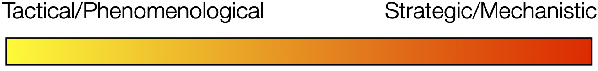

```{r setup, include = FALSE}
knitr::opts_chunk$set(cache = FALSE, 
                      echo = FALSE, 
                      message = FALSE, 
                      warning = FALSE,
                      #fig.height=6, 
                      #fig.width = 1.777777*6,
                      tidy = FALSE, 
                      comment = NA, 
                      highlight = TRUE, 
                      prompt = FALSE, 
                      crop = TRUE,
                      comment = "#>",
                      collapse = TRUE)
library(knitr)
library(kableExtra)
library(xtable)
library(viridis)

options(stringsAsFactors=FALSE)
knit_hooks$set(no.main = function(before, options, envir) {
    if (before) par(mar = c(4.1, 4.1, 1.1, 1.1))  # smaller margin on top
})
knitr::opts_chunk$set(echo = FALSE)
knitr::opts_knit$set(width = 60)
source("my_knitter.R")
#library(tidyverse)
#library(reshape2)
#theme_set(theme_light(base_size = 16))
make_latex_decorator <- function(output, otherwise) {
  function() {
      if (knitr:::is_latex_output()) output else otherwise
  }
}
insert_pause <- make_latex_decorator(". . .", "\n")
insert_slide_break <- make_latex_decorator("----", "\n")
insert_inc_bullet <- make_latex_decorator("> *", "*")
insert_html_math <- make_latex_decorator("", "$$")
## classoption: aspectratio=169
```


## Population dynamics of disease

The number of hosts, vectors, pathogens, and infected individuals change over time. 

We use models models of various types to: 
- understand relationships
- ***forecast/predict possible future outcomes***

## What types of models?

<center>



</center>

::: columns
::: {.column width="50%"}

- Focus on describing/quantifying patterns
- Statistical Models, e.g. regression, time series

:::

::: {.column width="50%"}
- Seek to understand mechanisms, less prediction
- ODEs, dynamical systems, Stochastic DEs, Individual Based Models

:::
:::

We'll focus on the tactical end of things here (i.e., no dif eqs)

## Simple example: A first (deterministic) model

::: columns
::: {.column width="50%"}
Suppose we model a population in discrete time as \begin{align*}
N(t+1) = s N(t) + b(t).
\end{align*}

Here $s$ is the fraction of individuals surviving each time step and $b(t)$ is the number of new births.
:::

::: {.column width="50%"}
`r sk1()`

```{r, echo=FALSE, fig.align='center', fig.height=8}
Tmax<-60
times<-1:Tmax

N<-rep(NA, Tmax)
N0<-20
N[1]<-N0


s<-0.8
b<-10
for(i in 2:Tmax) N[i]<- s*N[i-1]+b
par(mar = c(4.1, 5.1, 1.1, 1.1))
plot(times, N,  type="l", xlab="Time",
     ylab="Population", lwd=3, ylim=c(20, 55),
     main=paste("s = ", s, "   b = ", b, sep=""), 
     cex.main=2, cex.axis=2, cex.lab=2)
```
:::
:::

## A first (stochastic) model

In that simplest model the population can't go extinct!

`r sk1()`

What if the number of births vary? \begin{align*}
N(t+1) = s N(t) + b(t) +W(t)
\end{align*}

Here $W(t)$ is `r mygrn("process uncertainty/stochasticity")`: we assume it is drawn from a particular distribution, and each year/time we observe a particular value $w(t)$. E.g., $W(t) \stackrel{\mathrm{iid}}{\sim} \mathcal{N}(0, \sigma^2)$.

`r sk1()`

What might we see? `r myblue("When would the population go extinct?")`

------------------------------------------------------------------------

```{=tex}
\begin{align*}
N(t+1) = & s N(t) + b(t) + W(t)\\
W(t) & \stackrel{\mathrm{iid}}{\sim} \mathcal{N}(0, \sigma^2)
\end{align*}
```
```{r, echo=FALSE, fig.align='center'}
set.seed(12)
sigma<-c(5, 15, 25)
N.stoch<-matrix(NA, ncol=Tmax, nrow=length(sigma))
N.stoch[,1]<-N0
for(j in 1:length(sigma)){
    for(i in 2:Tmax){
        if(N.stoch[j,i-1]==0){
            N.stoch[j,i]<-0
        }else{
            N.stoch[j,i]<- s*N.stoch[j,i-1]+b+rnorm(1, 0, sd=sigma[j])
        }
        if(N.stoch[j,i]<0) N.stoch[j,i]<-0
    }
}

par(mfrow=c(1,3), bty="n")
for(j in 1:length(sigma)){
    plot(times, N.stoch[j,],  type="l", xlab="Time",
         ylab="Population", lwd=3, 
         main=paste("sigma = ", sigma[j], sep=""), ylim=c(0,120))
}
```

## Observation Models

We also have to go out into the field and take some observations of the populations. 

Let's say that we observe $N_{\mathrm{obs}}(t)$ individuals at time $t$. How does this relate to the true population size? One possibility is: \begin{align*}
N_{\mathrm{obs}}(t) = N(t) + V(t)
\end{align*} where $V(t)$ is our "observation uncertainty", and all together this equation describes our `r myblue("observation model")`.

------------------------------------------------------------------------

With the observation model, our full system (process + observation models) might be \begin{align*}
N(t) & = s N(t-1) + b(t-1) +W(t)\\
N_{\mathrm{obs}}(t) & =  N(t) + V(t)
\end{align*} 

plus:

- distributions for $W(t)$, $V(t)$
- the initial population size.

## Observation process matters

Analysis approach depends on not only the goal of the modeling exercise (understanding vs. forecasting/prediction) but also on details of the way that data are observed

- evenly or unevenly spaced observations
- consistent sampling locations
- types of observation/instrument (automated? trap type?)

Although we focus on tools this week, we'll also talk about general modeling considerations and how to think some of these as we conduct an analyses.

## Producing Forecasts

A *`r myred("forecast")`* is a prediction or estimate of events into the future. 

It differs from a scenario based future predictions in that it doesn't seek to answer any "what if" questions. 

Which could be a forecast vs. a scenario based prediction?

- temperature and rainfall tomorrow
- average number of hurricanes per year if we increase carbon emissions 10%
- number of COVID cases next winter
- number of flu cases next winter if vaccines are more effective

## Forecasting Process

1. Define Goal - what to forecast? how far out?
2. Get Data - what resolution? any predictors?
3. Explore/Visualize - outliers? spacing?
4. Pre-Processing - clean and organize data
5. Partitioning - need to test our forecasts
6. Modeling - what methods? what predictors?
7. Evaluation - how good is the forecast?
8. Implementation - make it repeatable, maybe automate


## Outline of Course

0. Introductions and Goals
1. Regression refresher focusing on diagnostics and transformations
2. Regression approaches for time dependent data -- basics plus time dependent predictors, transformations, simple AR
3.  Abundance data from VecDyn and NEON + climate and meteorological variables
4.  Analysis of evenly-spaced data: basic time-series methods
5.  Advanced modeling with Gaussian Process Models
