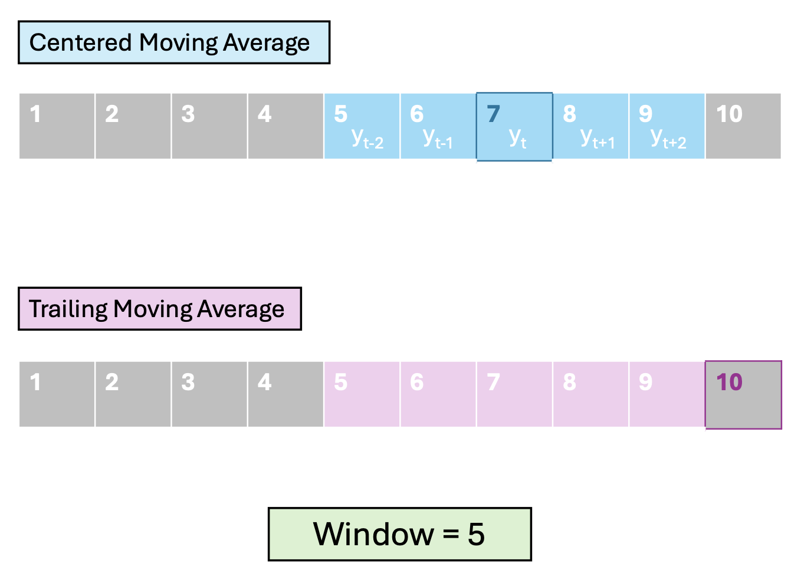
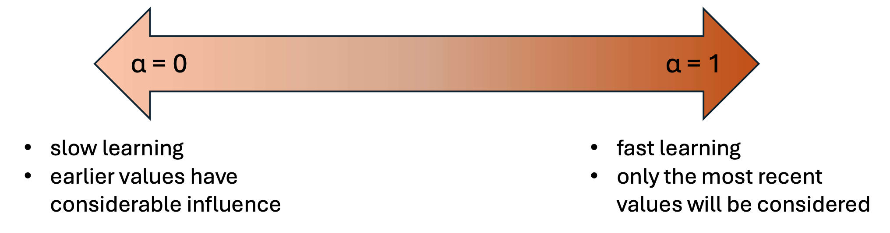

```{r setup, include = FALSE}
knitr::opts_chunk$set(cache = FALSE, 
                      echo = FALSE, 
                      message = FALSE, 
                      warning = FALSE,
                      #fig.height=6, 
                      #fig.width = 1.777777*6,
                      tidy = FALSE, 
                      comment = NA, 
                      highlight = TRUE, 
                      prompt = FALSE, 
                      crop = TRUE,
                      comment = "#>",
                      collapse = TRUE)
library(knitr)
library(kableExtra)
library(xtable)
library(viridis)

options(stringsAsFactors=FALSE)
knit_hooks$set(no.main = function(before, options, envir) {
    if (before) par(mar = c(4.1, 4.1, 1.1, 1.1))  # smaller margin on top
})
knitr::opts_chunk$set(echo = FALSE)
knitr::opts_knit$set(width = 60)
source("my_knitter.R")
#library(tidyverse)
#library(reshape2)
#theme_set(theme_light(base_size = 16))
make_latex_decorator <- function(output, otherwise) {
  function() {
      if (knitr:::is_latex_output()) output else otherwise
  }
}
insert_pause <- make_latex_decorator(". . .", "\n")
insert_slide_break <- make_latex_decorator("----", "\n")
insert_inc_bullet <- make_latex_decorator("> *", "*")
insert_html_math <- make_latex_decorator("", "$$")
## classoption: aspectratio=169
set.seed(1984)
```

## Learning Objectives

1. Introduce traditional time-series approaches
2. Be able to conduct simple time series analyses
3. Be able to produce a forecast for a time series model. 

## Recall: Time Series Data

Time dependent data may be considered a comprise a `r myred("time series")` (TS) if the data are observed at **`r myblue("evenly spaced intervals")`**. 


- Most TS methods *WILL NOT* work properly if data are irregularly spaced
- Occasionally data points may be missing -- then there are methods to interpolate.
- Irregularly spaced data may be aggregated in a systematic way to fulfill the TS requirements.

## Components of a time-series model

We can classify the patterns that we wish to quantify with a time series model into five categories:

- Level: the average value of the overall TS
- Trend: whether the TS tends to go up or down
- Seasonality: the tendency of the TS to repeat or cycle with a set frequency
- Auto-regression: correlation in the TS with nearby times
- Noise: random components, not correlated to other parts of the model

## Last time: Regression based

We previously used a regression approach to allow us to explore these patterns:

- Level: usually the intercept in the model
- Trend: added time as a predictor
- Seasonality: included sine/cosine predictors
- Auto-regression: response at lagged times as a predictor
- Noise: assumed additive, normal noise


We want to expand our toolbox and give ourselves more options to build models, and eventually use them to `r myblue("forecast!")`.


## First approach -- Smoothing

Often one of the first things we want to do is `r myblue("smooth")` a TS. This is simply averaging multiple time periods to reduce noise.  

`r sk1()`

This can, on it's own, bring out the "signal" in a TS. 

`r sk1()`

It's also super useful to produce smoothed time dependent predictors, so that you're not using noise/extreme values to predict patterns in your target TS. 

## Moving Average (MA) Models

In a MA model, average over a `r myblue("window")` of consecutive periods. 

`r sk1()`

We define the window by:

- *width* -- number of time points 
- *orientation* -- which time points

It is also possible to ***weight*** the time points, e.g., make nearby times more important.

-------------------------------------

We consider two main orientations

- Centered - used for visualizing trends

$$
\begin{align*}
MA_{t,w} = & \left(y_{t - (w-1)/2}  + \cdots + y_{t-1} \\
 + y_t + y_{t+1} + \cdots + y_{t - (w-1)/2} \right)/w
\end{align*}
$$

- Trailing - used for forecasting (because you only use the past)
$$
F_{t,w} = \left(y_{t - w +1} + \cdots + y_{t-1} + y_t \right)/w
$$

------------------------------------------------
   
<center>

{width=85%}

</center>

 
## Effects of smoothing: width

In base R, the `filter` function gives us an easy way to explore the effect of smoothing.


::: columns
::: {.column width="50%"}

*Short vs Long*

```{r, echo=TRUE}
t<-1:length(airquality$Temp)
wind<-airquality$Wind
## centered
FC5<- filter(wind, 
             filter = rep(0.2, 5))

## longer centered
FC25<- filter(wind, 
              filter = rep(1/25,25), 
              sides=2)
```

:::

::: {.column width="50%"}


```{r, fig.align='center', fig.height=6, fig.width=6}
plot(t, wind, type="l", lwd=2, col="grey")
lines(t, FC5, col="red", lwd=2)
lines(t, FC25, col="mediumblue", lwd=3)
legend("topright", legend= c("w=5", "w=25"), 
       fill=c("red", "mediumblue"))
```

:::
:::


## Effects of smoothing: orientation

In base R, the `filter` function gives us an easy way to explore the effect of smoothing. 


::: columns
::: {.column width="50%"}

*Centered vs. Trailing*


```{r, echo=TRUE}
t<-1:length(airquality$Temp)
wind<-airquality$Wind
## centered
FC<- filter(wind, 
            filter = rep(1/9, 9))
## trailing:  by default
## filter function includes point
## t in the average
FT<- filter(wind, 
            filter = c(0,rep(1/9, 9)), 
            sides=1)
```

:::

::: {.column width="50%"}


```{r, fig.align='center', fig.height=6, fig.width=6}
plot(t, wind, type="l", lwd=2, col="grey")
lines(t, FC, col="red", lwd=3)
lines(t, FT, col="dodgerblue", lwd=3)
legend("topright", legend= c("center", "trail"), 
       fill=c("red", "dodgerblue"))

```

:::
:::


## Effects of smoothing: weighting

In base R, the `filter` function gives us an easy way to explore the effect of smoothing.


::: columns
::: {.column width="50%"}

*Unweighted vs Weighted*

```{r, echo=TRUE}
t<-1:length(airquality$Temp)
wind<-airquality$Wind
## trailing 
FT10<- filter(wind, 
             filter = c(0,rep(0.1, 10)),
             sides = 1)

## trailing, weighted, coeffs in reverse time order
FT10w<- filter(wind, 
              filter = c(0, 0.3, 0.2, 0.1, 0.1, 
                         rep(0.05, 6)), 
              sides=1)
```

:::

::: {.column width="50%"}


```{r, fig.align='center', fig.height=6, fig.width=6}
plot(t, wind, type="l", lwd=2, col="grey")
lines(t, FT10w, col="purple", lwd=3)
lines(t, FT10, col="dodgerblue", lwd=3)
legend("topright", legend= c("W", "UnW"), 
       fill=c("purple", "dodgerblue"))

```

:::
:::


## Exponential Smoothing

Instead of weighting all points the same, or manually determining weights, `r mygrn("Exponential smoothing/moving average")` (ema) uses a special weighting of $k$ past values:
$$
\begin{align*}
ema_{t+1} = & \alpha y_t + \alpha(1-\alpha)y_{t-1} + \alpha(1-\alpha)^2 y_{t-2} \\
& + \cdots + \alpha(1-\alpha)^k y_{t-k}
\end{align*}
$$
where $\alpha$ is a smoothing constant between 0 and 1. This can be rewritten as a recurssion:

$$
ema_{t+1} = \alpha y_t + \alpha(1-\alpha)ema_{t} 
$$

## Choosing a smoothing constant

The value of $\alpha$ determines the influence of points farther in the past. This is sometimes called the "rate of learning"

<center>

{width=85%}

</center>

Default values are often around 0.1 - 0.2.

## Exponential Smoothing Example

The `filter` function doesn't give us quite what we want. Instead we can use the `EMA` function in the `TTR` package:

::: columns
::: {.column width="50%"}

*Unweighted vs Exponential*

```{r, echo=TRUE}
t<-1:length(airquality$Temp)
wind<-airquality$Wind
## trailing 
FT10<- filter(wind, 
             filter = rep(0.1, 10),
             sides = 1)

## exponential
FE  <- TTR::EMA(wind, 10)
```

:::

::: {.column width="50%"}


```{r, fig.align='center', fig.height=6, fig.width=6}
plot(t, wind, type="l", lwd=2, col="grey")
lines(t, FE, col="darkgreen", lwd=3)
lines(t, FT10, col="dodgerblue", lwd=3)
legend("topright", legend= c("UnW", "Exp"), 
       fill=c("dodgerblue", "darkgreen"))
```

:::
:::


## ARMA

We can combine the idea of smoothing back to capture signal while recognizing the high amount of correlation at nearby time-steps using **`r myblue("Auto-Regressive Moving Average (ARMA)")`** models.

We combine the AR($p$) (i.e., using $p$ lags) with a (trailing) MA($q$) model (i.e., window of size $q$). 

`r sk1()`

But how do we build the model?

## Specifying the MA part

The tricky bit is that the MA part that goes into the model is ***not*** the result of the smoother itself (i.e., it's not the $F_t$ on Slide 7). 

`r sk1()`

Instead, we use the *residuals* -- that is, how far the data at the previous time points are from the smoothed estimate based on $q$ previous times:
$$
\varepsilon_{t-1} = y_{t-1} - F_{t-1, q}
$$

## ARMA model

The ARMA($p,q$) model is then a regression model (like we saw in our previous AR model) but with extra parameters and terms corresponding to those errors:
$$
\begin{align*}
y_t =~& \beta_0 + \beta_1 y_{t-1} + \cdots + \beta_p y_{t-p} \\
& + \varepsilon_t + \theta_1 \varepsilon_{t-1} + \cdots \theta_q \varepsilon_{t-q} 
\end{align*}
$$

## Pros and Cons of ARMA

Pros:

- can capture some signal without needing to specify a functional form
- fairly flexible and tunable

Cons: 

- don't capture trends or seasonality well (assume nearly stationary)
- forecasts must be done one step ahead at a time


## ARIMA and SARIMA

In order to relax the assumption of stationarity and allow for seasonality/periodicity, we can add another letter "I" for `r mygrn("Integrated")` and "S" for `r mygrn("Seasonal")`.

`r sk1()`

What does this mean? First a digression....


## Differencing

AR/ARMA models without explicit trend or periodic components can only describe data that are stationary. 

It turns out that we fiddle with a non-stationary TS to get something that is stationary through ***differencing*** -- that is, computing the differences between consecutive data points (or at another fixed lag).

-----------------------

Lag-1 differencing removes trends from a TS:

```{r}

```


## Outline of the rest

- ARIMA (putting together AR + smoothing)
- Putting and AR process on top of other models
- More details on actually forecasting
  - training vs testing
  - predicting ahead (why it's tricky) -- can't use future predictors.
  - forecast package in R makes all of this relatively easy.

 
------------------------------------------------
   
`r mygrn("Example")`: $Y_t =$ average daily temp. at ROA, Feb-Mar 2018.

```{r, echo=TRUE, fig.align='center', fig.height=4, fig.width=8}
weather <- read.csv("data/Roanoke_weather2018.csv")
days<-32:90 ## This picks out February and March
weather<-weather[days,c(1,3,7,4)]
names(weather)[3]<-"temp"
plot(days, weather$temp, xlab="day of year", ylab="temp (F)", type="l", col=2, lwd=2)
```

-   "sticky" sequence: today tends to be close to yesterday.
 
------------------------------------------------
   
`r mygrn("Example")`: $Y_t =$ monthly UK deaths due to lung infections

```{r, echo=TRUE, fig.align='center', fig.height=4, fig.width=8}
ld<-as.vector(ldeaths)
plot(ld, xlab="month", ylab="deaths", type="l", 
     col=4, lwd=2)
```

-   The same pattern repeats itself year after year.
 
------------------------------------------------

`r mygrn("Example")`: uncorrelated samples from a normal random number generator.


```{r, echo=TRUE, fig.align='center', fig.height=4, fig.width=8}
plot(rnorm(200), xlab="t", ylab="Y_t", type="l", 
     col=6, lwd=2)
```

-   It is tempting to see patterns even where they don't exist.
 

   
## Checking for dependence

To see if $Y_{t-1}$ would be useful for predicting $Y_t$, just plot them together and see if there is a relationship.

::: columns
::: {.column width="50%"}

```{r, fig.align='center', fig.height=5, fig.width=5}
plot(weather$temp[1:58], weather$temp[2:59], pch=20,
     col=4, main="Daily Temp at ROA", 
     xlab="temp(t-1)",
     ylab = "temp(t)")
text(x=31, y=68, col=2, cex=1.5,
     labels=paste("Corr =", round(cor(weather$temp[1:58],weather$temp[2:59]),2))
     )
```

:::

::: {.column width="50%"}

`r sk1()`

-   Correlation between $Y_t$ and $Y_{t-1}$ is called `r myred("autocorrelation")`.
 
:::
:::

 


 
